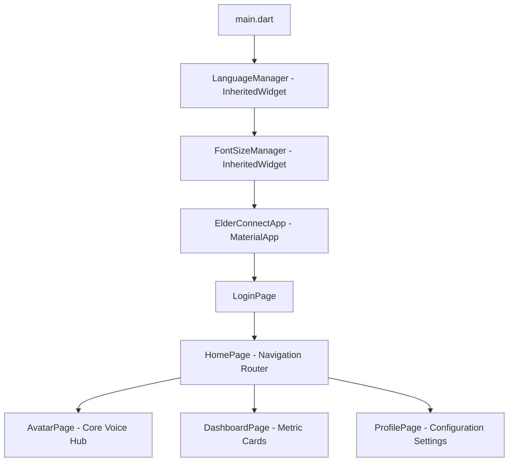

Here is a comprehensive, production-ready `README.md` tailored specifically for your **ElderConnect** project. It is structured to serve as clean documentation for your GitHub profile or research portfolio.

---

# ElderConnect

ElderConnect is an accessibility-focused assistant application developed in Flutter, specifically engineered to support elderly users ($65+$) and their designated guardians. By pairing an empathetic, voice-interactive **AI Cartoon Companion** with localized health, safety, and community monitoring services, the application reduces technology anxiety and assists with daily cognitive tasks.

The system features real-time dual-language support (**English and Korean**), automated layout scaling, voice interaction using Native STT/TTS, embedded video delivery, and localized syndication feeds.

---

## 🛠️ Key Architectural Features

* **Vector Avatar Engine (`CustomPainter`)** An asset-free, pure vector cartoon companion avatar designed with programmatic expressions. The avatar adapts dynamically based on application lifecycle triggers, closing its eyes to "listen" during STT recording and moving its mouth during active TTS loops.
* **Dual-Profile Authentication Gateway** A flexible portal catering to **Seniors** and **Guardians**, featuring localized credential configuration flows and social integration bindings (Google, Kakao, Naver).
* **Context-Aware Dialog Logic** Integrates system-level long-term memory structures (such as tracking chronic symptoms like knee pain or referencing family members) into conversational payloads to provide highly personalized interactions.
* **Elderly-First Accessibility Framework** Built with a centralized `FontSizeManager` that defaults to high-scale text scaling ($\times1.4$), paired with touch-friendly dashboard metrics spanning medication schedules, geo-fenced safe zones, and quick-action emergency dispatching.
* **Real-time Syndication Parser (`webfeed_plus`)** Queries live, localized news networks directly within the primary application loop, featuring an text-to-speech option allowing users to hear headlines spoken aloud.

---

## 🏗️ Project Architecture Overview



---

## 📦 Dependencies & Prerequisites

Before configuring the project workspace, ensure your environment includes the appropriate native access capabilities for audio hardware hooks.

### Core Dependencies

Add the following to your `pubspec.yaml`:

```yaml
dependencies:
  flutter:
    sdk: flutter
  flutter_localizations:
    sdk: flutter
  google_sign_in: ^6.2.1
  kakao_flutter_sdk_user: ^1.9.0
  speech_to_text: ^6.6.0
  flutter_tts: ^4.0.2
  http: ^1.2.1
  youtube_player_flutter: ^9.0.1
  url_launcher: ^6.3.0
  webfeed_plus: ^1.0.1
  xml: ^6.5.0
  google_generative_ai: ^0.4.0

```

### OS-Specific Hardware Permissions

#### Android (`android/app/src/main/AndroidManifest.xml`)

```xml
<manifest xmlns:android="http://schemas.android.com/apk/res/android">
    <uses-permission android:name="android.permission.RECORD_AUDIO" />
    <uses-permission android:name="android.permission.INTERNET" />
    <uses-permission android:name="android.permission.BLUETOOTH" />
</manifest>

```

#### iOS (`ios/Runner/Info.plist`)

```xml
<key>NSMicrophoneUsageDescription</key>
<string>ElderConnect requires microphone access to translate spoken words into text commands for your avatar assistant.</string>
<key>NSSpeechRecognitionUsageDescription</key>
<string>ElderConnect requires speech recognition permissions to parse voice interaction events.</string>

```

---

## 🚀 Installation & Build Instructions

1. **Clone the repository:**
```bash
git clone https://github.com/your-username/elderconnect.git
cd elderconnect

```


2. **Fetch dependencies:**
```bash
flutter pub get

```


3. **Verify Connected Device Targets:**
```bash
flutter devices

```


4. **Execute local Debug build:**
```bash
flutter run

```


---

## 🧩 Code Reference: Avatar Page Custom Painter

The interface relies on the custom-drawn `CartoonGirlPainter` to handle avatar layout mutations efficiently without triggering standard asset-rendering overhead.

```dart
// The paint routine uses basic geometric properties to handle runtime transformations
@override
void paint(Canvas canvas, Size size) {
  final center = Offset(size.width / 2, size.height / 2);
  
  // Renders structural base, eyes, hair layers, and accessories...
  if (isListening) {
    // Draws curved arcs representing focused listening behavior
  } else {
    // Draws standard circular pupils with dual reflection highlights
  }
}

```

---

## 📄 License

This repository is licensed under the **MIT License**. See the `LICENSE` file for details.
